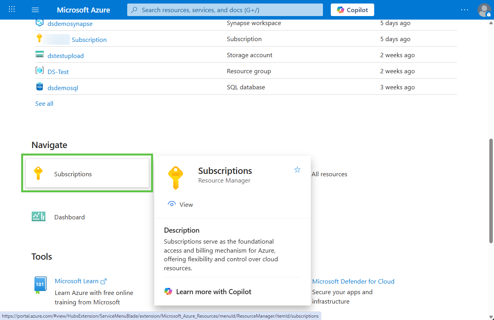
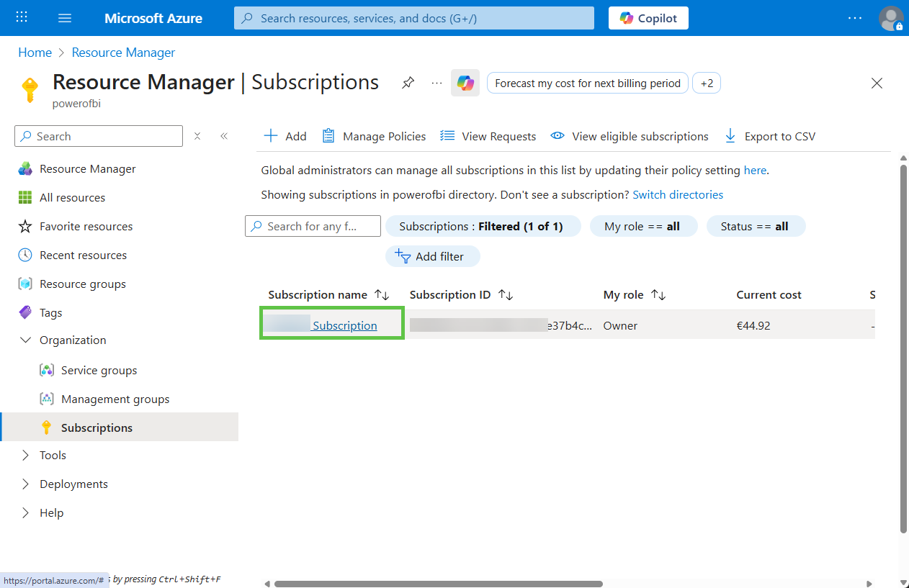
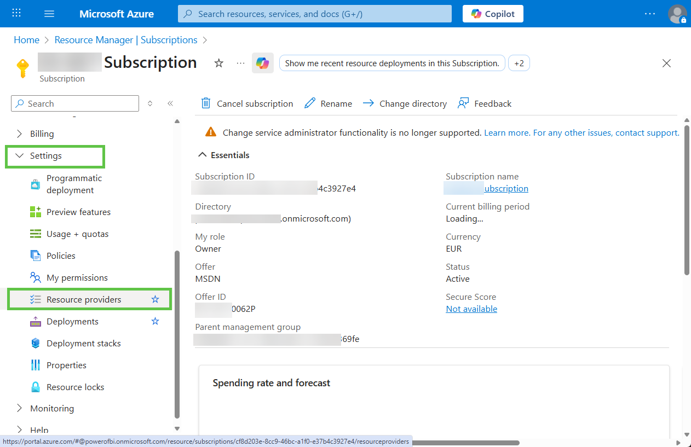
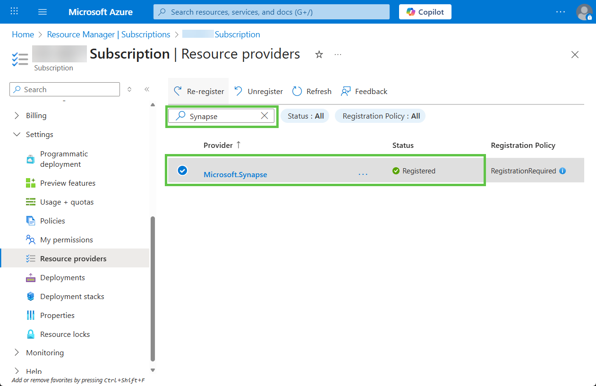
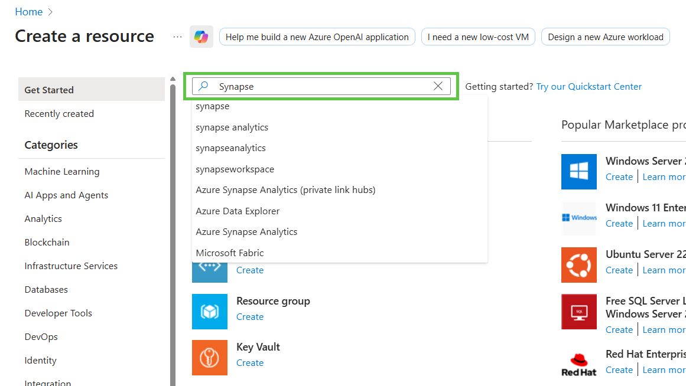
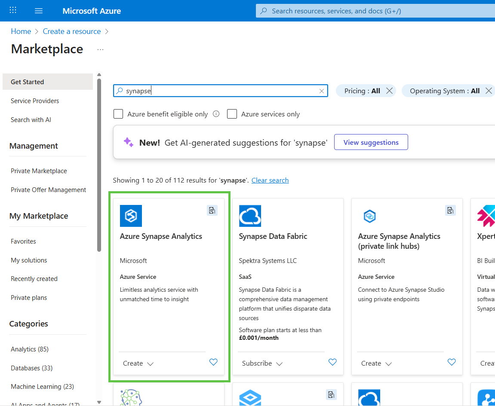
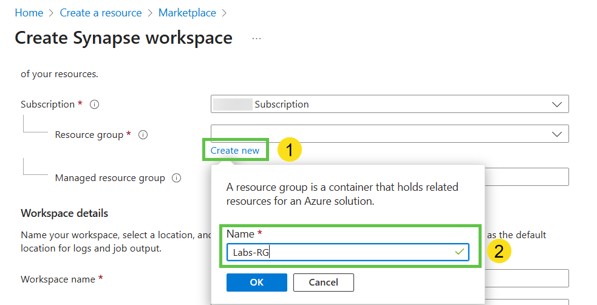
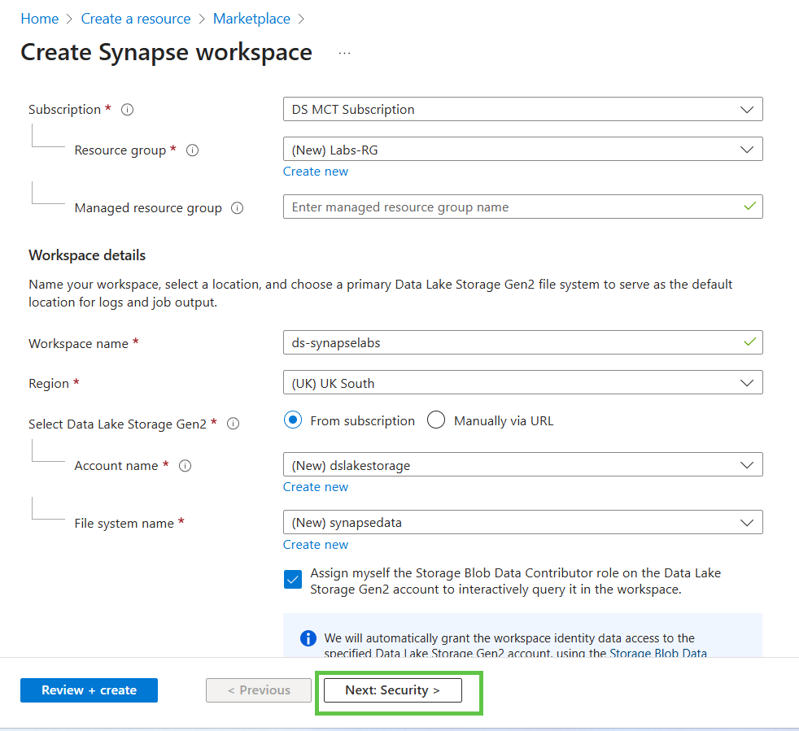
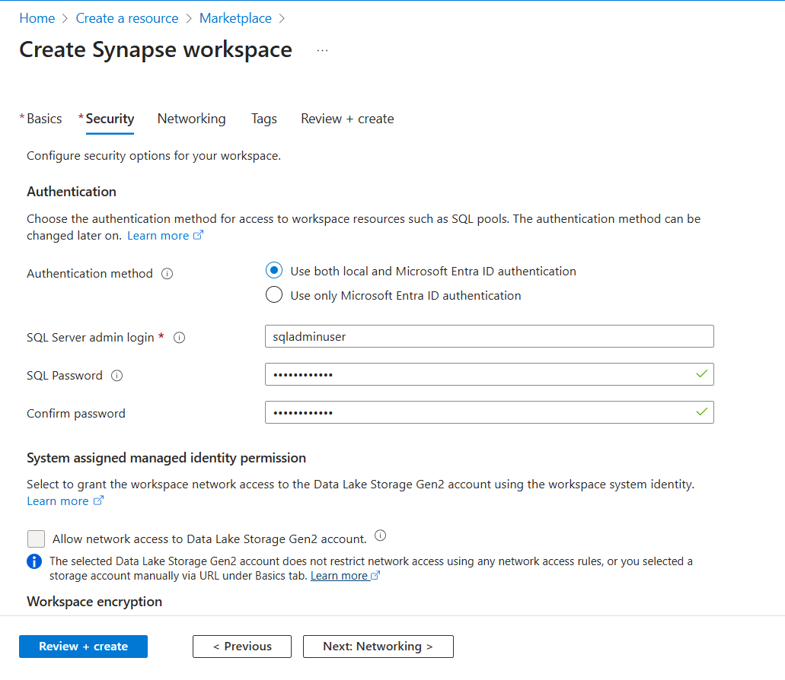
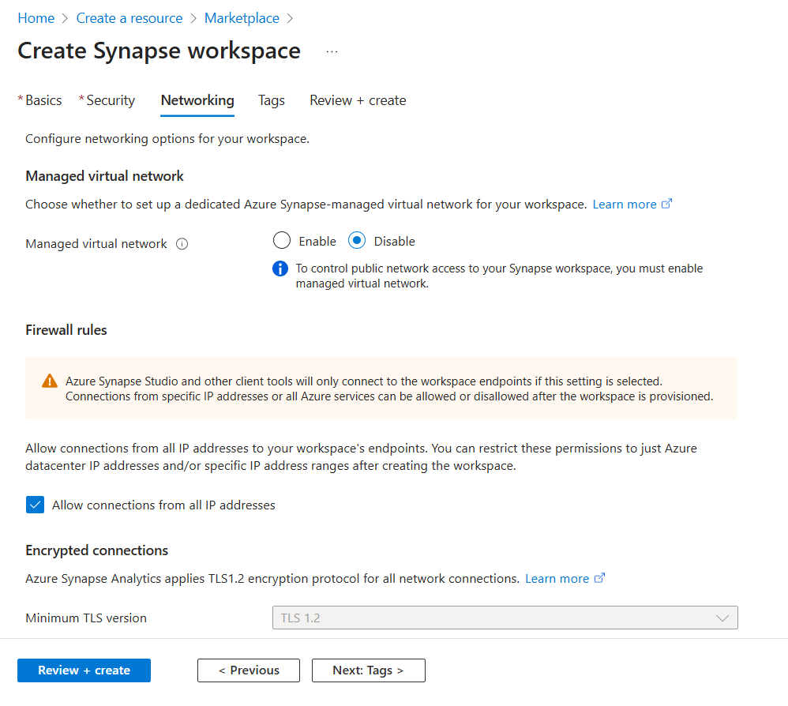

# Provision Synapse Analytics Workspace

Please use Azure credentials dedicated for your lab environment. Estimated time to complete: **10** minutes.

---
## 1. Validate if Microsoft.Synapse Resource provider is registered
A resource provider is a collection of REST operations that enables functionality for an Azure service, for example Azure Synapse Analytics. In order to deploy a service related resource provider must be registered in the Azure Subscription. In most cases they are already registered, however it's worth to check. List of Reource providers for Azure analytics services is [there](https://learn.microsoft.com/en-us/azure/azure-resource-manager/management/azure-services-resource-providers#analytics-resource-providers)

You must have permission to do the /register/action operation for the resource provider. The permission is included in the Contributor and Owner roles. Reregister a resource provider when the resource provider.supports new locations that you need to use. More information can be found there [https://learn.microsoft.com/en-us/azure/azure-resource-manager/management/resource-providers-and-types](https://learn.microsoft.com/en-us/azure/azure-resource-manager/management/resource-providers-and-types)

1. Open the **Azure Portal** [https://portal.azure.com](https://portal.azure.com)
1. Scroll down to the **Navigate** section and click the **Subscriptions** button
  
1. On the **Subscriptions** page check the list of subscriptions and click on the subscription name you'll use for the Synapse Analytics Workspace deployment
  
1. On the **Subscription** page in the left panel expand the **Settings** section and click the **Resource providers** link.
  
1. The **Resource providers** page is opened now. In the **Search** input type *Synapse* to find the **Microsoft.Synapse** provider we need. Ensure it's registered. Register it if not.
  

You successfully checked (registered) resource provider and can continue with the resource provisioning.

## 2. Create a New Resource

1. Open the **Azure Portal** [https://portal.azure.com](https://portal.azure.com).
2. At the top, click **Create a resource**.

---

## 3. Search for Synapse

1. In the search bar, type **Synapse** and press **Enter**.
2. From the search results, select **Azure Synapse Analytics**.
3. Click **Create**.

---

## 4. Configure Basics

### Resource Group
- Create a new Resource Group.  
  Example: **Labs‑RG**

### Managed Resource Group
- Leave **Managed Resource Group name** empty.

### Workspace Name
- Use a unique workspace name.  
  Example: **ds-synapselabs**

### Region
- Select a recommended region such as:
  - East US  
  - UK South  
  - North Europe  

### Data Lake Storage (Gen2)
1. Choose **From Subscription**.
1. Create:
   - A new **Storage Account**. Use unique name. For example - Your initials lake storage. Name should not contain spaces.  
     Example: **dslakestorage**
   - A new **File System** named **synapsedata**
1. Ensure the checkbox is selected:

   > **Assign myself the Storage Blob Data Contributor role on the Data Lake Storage Gen2 account to interactively query it in the workspace**

---

## 5. Configure Security

1. Click **Next: Security**.
2. Select:

   > **Use both local and Microsoft Entra ID authentication**

3. Enter a strong SQL admin password and store it safely.

---

## 6. Configure Networking

1. Click **Next: Networking**.
2. Review network options.
3. Ensure connections from **all IP addresses are allowed**.
4. Click **Review and create**.

---

## 7. Deploy Workspace

- Click **Create** to start deployment.
- Deployment will take **5–10 minutes**.

