---
lab:
    title: 'Provision and explore Azure Databricks'
    ilt-use: 'lab'
---

# Provision Azure Databricks

Azure Databricks is a Microsoft Azure-based version of the popular open-source Databricks platform.

Similarly to Azure Synapse Analytics, an Azure Databricks *workspace* provides a central point for managing Databricks clusters, data, and resources on Azure.

This exercise should take approximately **30** minutes to complete.

## Before you start

You'll need an [Azure subscription](https://azure.microsoft.com/free) in which you have administrative-level access.

## Provision an Azure Databricks workspace

In this exercise, you'll use the Azure Portal to provision a new Azure Databricks workspace.
1. In a web browser, sign into the [Azure portal](https://portal.azure.com) at `https://portal.azure.com`.
2. At the top, click **Create a resource**.

3. In the search bar, type **Databricks** and press **Enter**.
4. From the search results, select **Azure Databricks**.
5. Click **Create**.
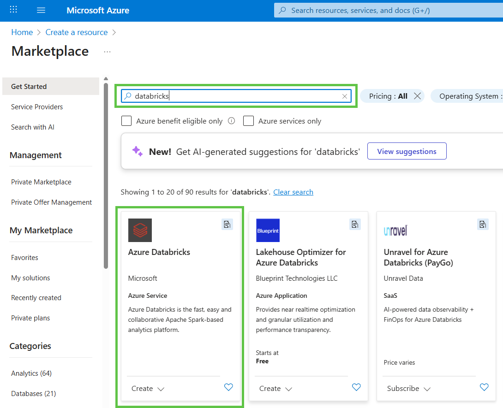
6. In the **Basics** tab select the following settings:
    - **Subscription** – choose your Azure subscription.  
    - **Resource group** – select an existing one or click **Create new** and enter `Databricks-lab`.  
    - **Workspace name** – enter `dp203-databricks`.  
    - **Region** – select `UK South` (or the region you need).  
    - **Pricing Tier** – choose **Trial (Premium – 14-Days Free DBUs)** or **Premium** if trial is not available
    - Leave **Managed Resource Group name** empty (it will be generated automatically).

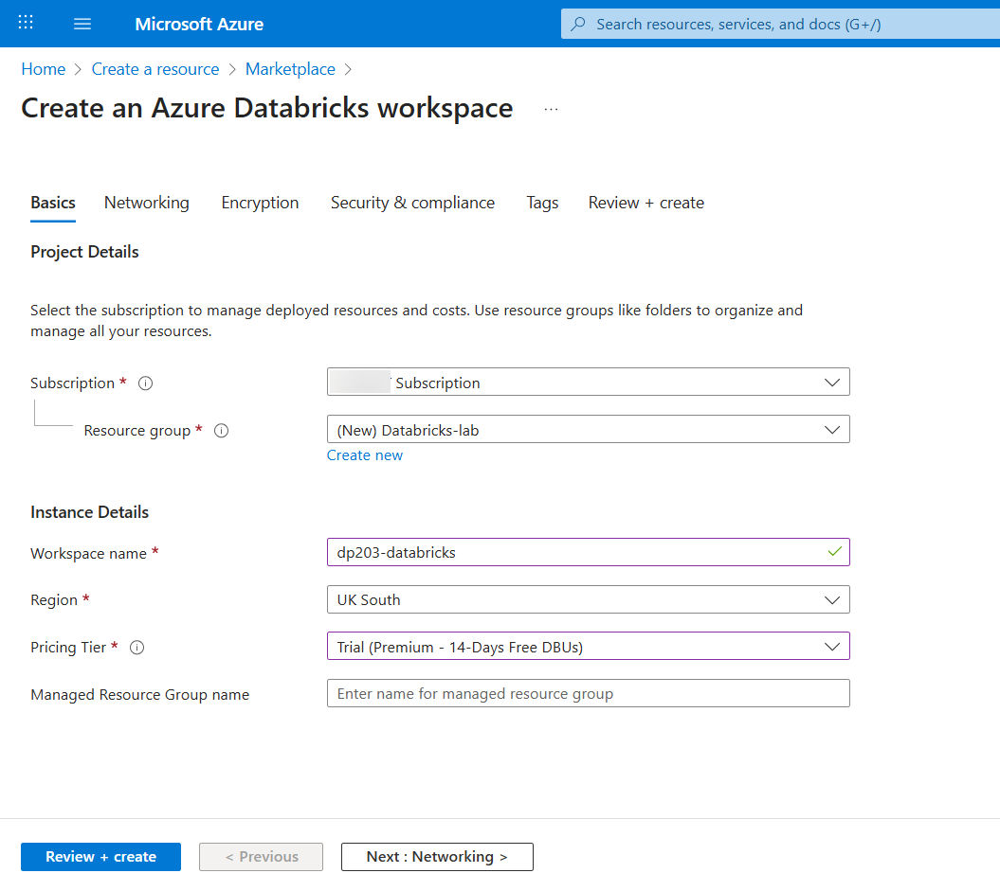

7. When finished, click **Review + create**.
8. Wait for **Validation succeeded** to appear at the top.  
9. Review the summary:  
   - Workspace name  
   - Subscription  
   - Resource group  
   - Region  
   - Pricing tier  
   - Networking and Encryption options  
10. If everything looks correct, click **Create**.

   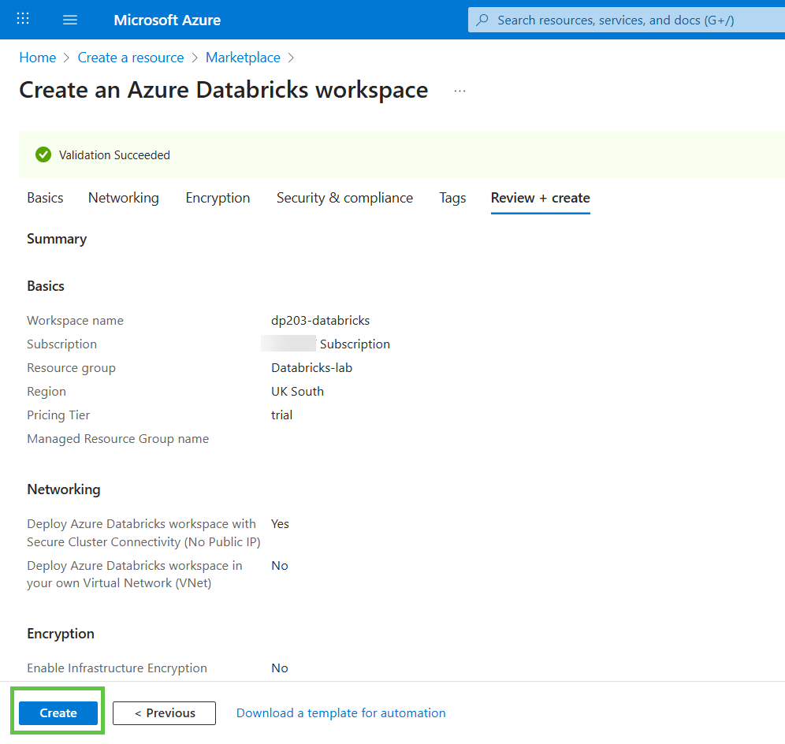

Azure will now deploy your Azure Databricks workspace. It might take 5-10 minutes. You shouldn't wait for completion, please proceed with the next lab section. 
---

## Validate vCPU quotas

In this section, you'll validate if your Azure subscription has a sufficient cores quota and request an increase if necessary.
1. In a web browser, sign into the [Azure portal](https://portal.azure.com) at `https://portal.azure.com`.
2. In the search bar type "Quotas" and click on the "Quotas" in the "Services" section of the search result
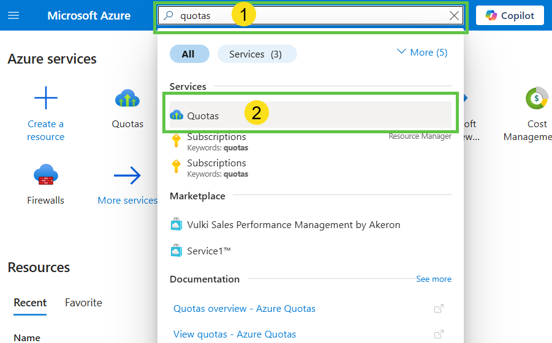
3. On the "Quotas overview" page click on the "Compute" button.
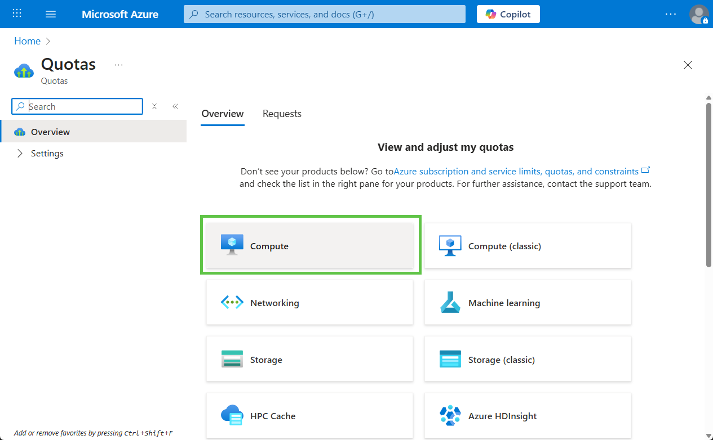
4. At the top, ensure the **Region** filter is set to **UK South**.
5. In the search box, type **Standard DS** to filter only DS-series vCPUs.
6. Locate **Standard DSv2 Family vCPUs** in the table.
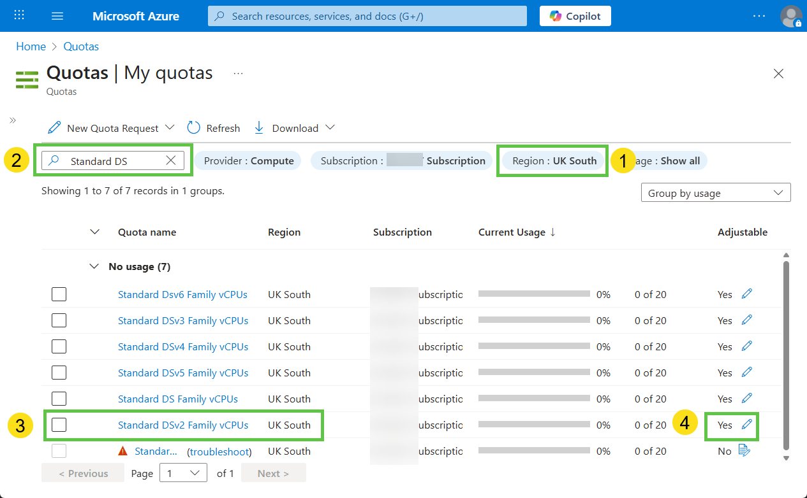
7. If it shows less than 20 total cores - request qouta increase up to 20 cores:
    - On the right side, under **Adjustable**, click the **pencil** icon (✏️) next to **Yes**.
    - Type 20 in the new limit
    - Press **Submit** button and wait for completion.
8. If you weren't able to increase quota - try another region, for example East US


## Create a cluster

Azure Databricks is a distributed processing platform that uses Apache Spark *clusters* to process data in parallel on multiple nodes. Each cluster consists of a driver node to coordinate the work, and worker nodes to perform processing tasks.

In this exercise, you'll create a *single-node* cluster to minimize the compute resources used in the lab environment (in which resources may be constrained). In a production environment, you'd typically create a cluster with multiple worker nodes.

> **Tip**: If you already have a cluster with a 17.3 LTS runtime version in your Azure Databricks workspace, you can use it to complete this exercise and skip this procedure.

1. In the Azure portal, browse to the **Databricks-lab** resource group that was created on provisioning Azure Databricks(or the resource group containing your existing Azure Databricks workspace)
1. Select your Azure Databricks Service resource (named **dp203-databricks** if you followed the instructions).
1. In the **Overview** page for your workspace, use the **Launch Workspace** button to open your Azure Databricks workspace in a new browser tab; signing in if prompted.

    > **Tip**: As you use the Databricks Workspace portal, various tips and notifications may be displayed. Dismiss these and follow the instructions provided to complete the tasks in this exercise.

1. View the Azure Databricks workspace portal and note that the sidebar on the left side contains links for the various types of task you can perform.

1. Press the **Compute** link in the sidebar. You'll see page with different compute types. As of now you don't have any compute resources provisioned.
1. On the **All-Purpose Compute** tab press the **Create compute** button

1. In the **New Cluster** page, create a new cluster with the following settings:
    - **Compute name**: *User Name's* cluster (the default cluster name)
    - **Policy**: Unrestricted
    - **Machine Learning**: Unchecked
    - **Databricks runtime version**: 17.3 LTS (Spark 4.0.0, Scala 2.13)
    - **Use Photon Acceleration**: Selected
    - **Node type**: Standard_DS3_v2
    - **Single node**: Selected
    - **Terminate after** *30* **minutes of inactivity**

1. Wait for the cluster to be created. It may take a minute or two.

> **Note**: If your cluster fails to start, your subscription may have insufficient quota in the region where your Azure Databricks workspace is provisioned. See [CPU core limit prevents cluster creation](https://docs.microsoft.com/azure/databricks/kb/clusters/azure-core-limit) for details. If this happens, you should validate quotas and try deleting your workspace and creating a new one in a different region. 

## Use Spark to analyze a data file

As in many Spark environments, Databricks supports the use of notebooks to combine notes and interactive code cells that you can use to explore data.

1. In the sidebar, use the **(+) New** link to create a **Notebook**.
1. Change the default notebook name (**Untitled Notebook *[date]***) to **Explore products** and in the **Connect** drop-down list, select your cluster if it is not already selected. If the cluster is not running, it may take a minute or so to start.
1. Download the [**products.csv**](https://raw.githubusercontent.com/dmitriysolovev/data-engineer/main/labs/alldata/lab15/data/products.csv) file to your local computer, saving it as **products.csv**. Then, in the **Explore products** notebook, on the **File** menu, select **Upload data to volume**.
1. In the **Upload Data** dialog box:
    - In the **All catalogs** section select **dp203_databricks** (or another name similar to your databricks resourse name) and then select **Default**
    
    - Note there are no volumes yet. Press **Create volume** button.
    - In the volume creation dialog type volumne name **labdata**, keep other parameters as is and press **Create** button.
    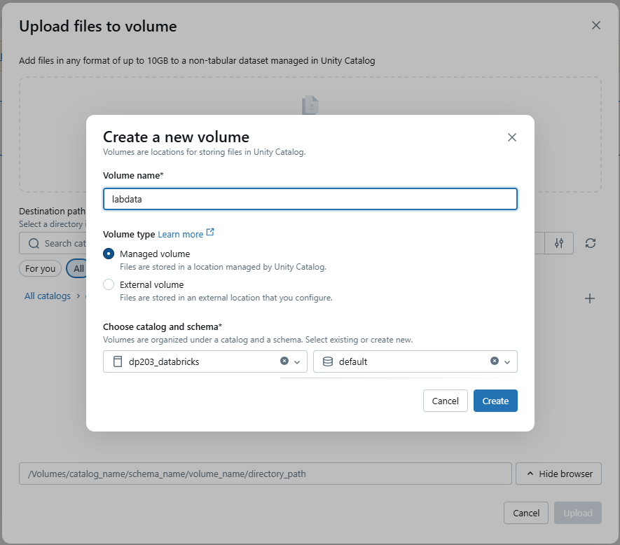
    - Upload the **products.csv** file you downloaded to your computer. When the file has been uploaded, select **Next**
1. In the **Upload summary** pane click on the uploaded file path.
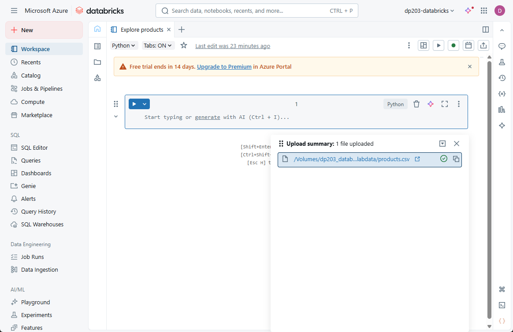
1. New browser tab appears. It's a **Catalog** view. Here you can explore all files and tables available in the Unity catalog. Please notice the directory path. It look like **/Volumes/dp203_databricks/default/labdata**. You'll use it to access data located in the catalog.
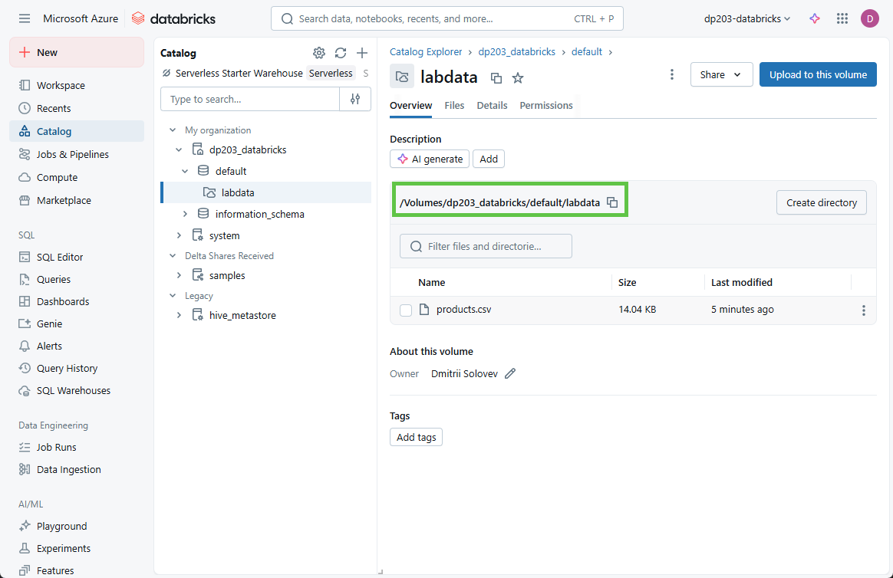


1. Return to the **Explore products** notebook and insert the following code to the empty code cell. Don't forget to adjust code if you used another names for Azure Databricks workspace and volume.

    ```python
    products_df = spark.read.format("csv").option("header", "true").load("/Volumes/dp203_databricks/default/labdata/products.csv")
    display (products_df)
    ```

1. Use the **&#9656; Run Cell** menu option at the top-right of the cell to run it, starting and attaching the cluster if prompted.
1. Wait for the Spark job run by the code to complete. The code has created a *dataframe* object named **products** from the data in the file you uploaded and used *display* command to visualise it.
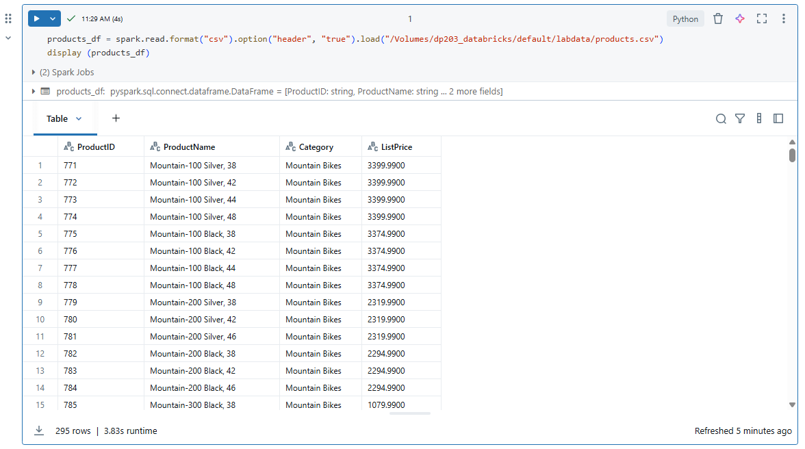
1. Above the table of results, select **+** and then select **Visualization** to view the visualization editor, and then apply the following options:
    - **Visualization type**: Bar
    - **X Column**: Category
    - **Y Column**: *Add a new column and select* **ProductID**. *Apply the* **Count** *aggregation*.

    Save the visualization and observe that it is displayed in the notebook, like this:

    

## Create and query a table

While many data analysis are comfortable using languages like Python or Scala to work with data in files, a lot of data analytics solutions are built on relational databases; in which data is stored in tables and manipulated using SQL.

1. In the **Explore products** notebook, under the chart output from the previously run code cell, use the **+** icon to add a new cell.
2. Enter and run the following code in the new cell:

    ```python
    products_df.write.saveAsTable("products")
    ```
3. The code above created a **Managed Delta table** in the **Default** schema. You can validate it by switching to the Catalog view. It's possible to use Spark code to create custom database schemas and a schema of relational tables that data analysts can use to explore data and generate analytical reports.
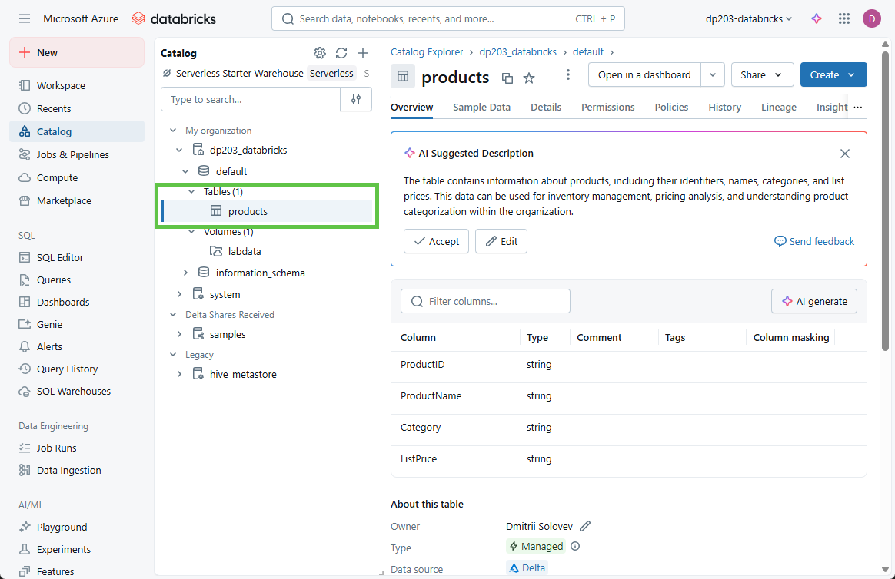

4. Return to the notebook and add a new cell under it with the following code:

    ```sql
    %sql

    SELECT ProductName, ListPrice
    FROM products
    WHERE Category = 'Touring Bikes';
    ```

4. Run the new cell, which contains SQL code to return the name and price of products in the *Touring Bikes* category.
5. You've finished Azure Databricks exploration. Navigate to the **Compute** section and terminate your cluster to avoid unnecessary charges.
