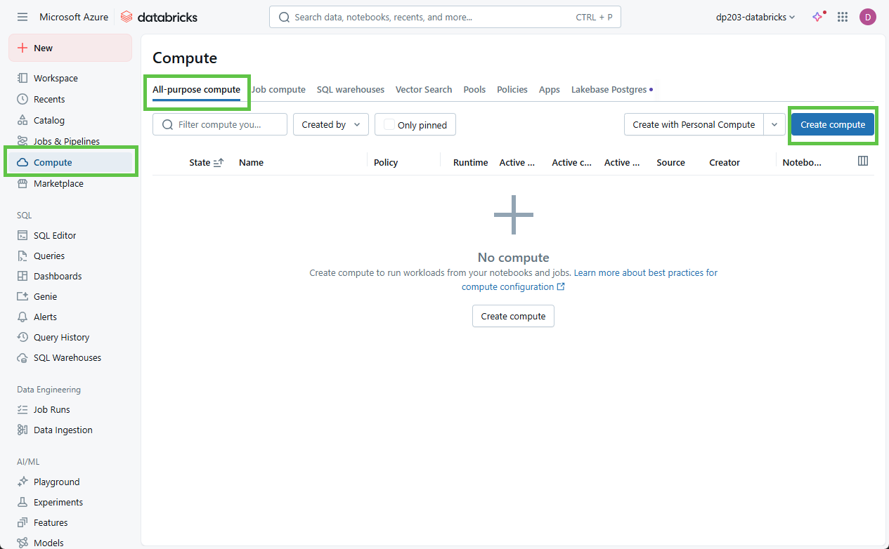
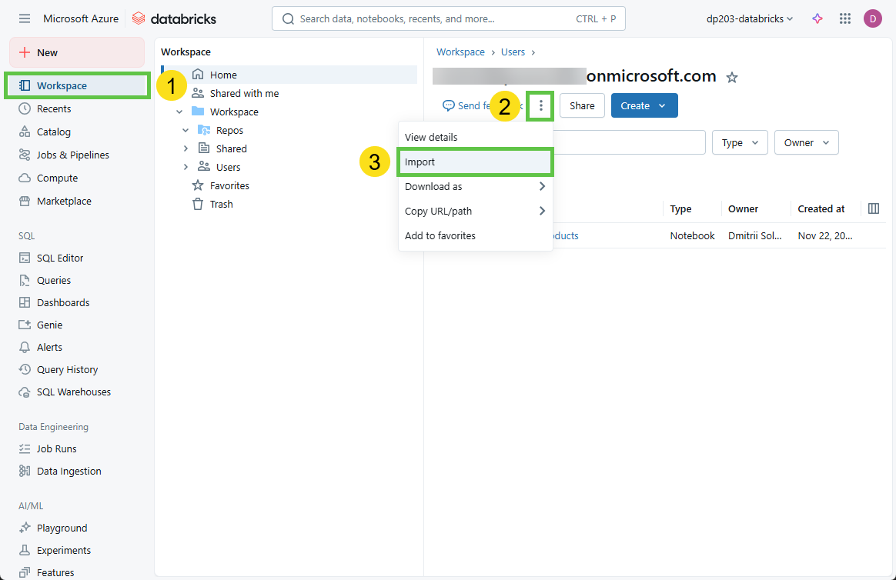

---
lab:
    title: 'Use Spark in Azure Databricks'
    ilt-use: 'Lab'
---

# Use Spark in Azure Databricks

Azure Databricks is a Microsoft Azure-based version of the popular open-source Databricks platform. Azure Databricks is built on Apache Spark, and offers a highly scalable solution for data engineering and analysis tasks that involve working with data in files. One of the benefits of Spark is support for a wide range of programming languages, including Java, Scala, Python, and SQL; making Spark a very flexible solution for data processing workloads including data cleansing and manipulation, statistical analysis and machine learning, and data analytics and visualization.

This exercise should take approximately **45** minutes to complete.

## Before you start

You'll need an [Azure subscription](https://azure.microsoft.com/free) in which you have administrative-level access.
You'll need an Azure Databricks workspace. If you haven't any workspaces provisioned, please follow the provisioning steps described in the [Lab 15 Provision and explore Azure Databricks](https://github.com/dmitriysolovev/data-engineer/blob/main/labs/15-Provision-explore-Azure-Databricks.md)

## Create a cluster

Azure Databricks is a distributed processing platform that uses Apache Spark *clusters* to process data in parallel on multiple nodes. Each cluster consists of a driver node to coordinate the work, and worker nodes to perform processing tasks.

> **Tip**: If you already have a cluster with a 17.3 LTS runtime version in your Azure Databricks workspace, you can use it to complete this exercise and skip this procedure.

1. In the Azure portal, browse to the **Databricks-lab** resource group that was created on provisioning Azure Databricks(or the resource group containing your existing Azure Databricks workspace)
1. Select your Azure Databricks Service resource (named **dp203-databricks** if you followed the instructions).
1. In the **Overview** page for your workspace, use the **Launch Workspace** button to open your Azure Databricks workspace in a new browser tab; signing in if prompted.

    > **Tip**: As you use the Databricks Workspace portal, various tips and notifications may be displayed. Dismiss these and follow the instructions provided to complete the tasks in this exercise.

1. View the Azure Databricks workspace portal and note that the sidebar on the left side contains links for the various types of task you can perform.

1. Press the **Compute** link in the sidebar. You'll see page with different compute types. As of now you don't have any compute resources provisioned.
1. On the **All-Purpose Compute** tab press the **Create compute** button

1. In the **New Cluster** page, create a new cluster with the following settings:
    - **Compute name**: *User Name's* cluster (the default cluster name)
    - **Policy**: Unrestricted
    - **Machine Learning**: Unchecked
    - **Databricks runtime version**: 17.3 LTS (Spark 4.0.0, Scala 2.13)
    - **Use Photon Acceleration**: Selected
    - **Node type**: Standard_DS3_v2
    - **Single node**: Selected
    - **Terminate after** *30* **minutes of inactivity**

1. Wait for the cluster to be created. It may take a minute or two.

> **Note**: If your cluster fails to start, your subscription may have insufficient quota in the region where your Azure Databricks workspace is provisioned. See [CPU core limit prevents cluster creation](https://docs.microsoft.com/azure/databricks/kb/clusters/azure-core-limit) for details. If this happens, you should validate quotas and try deleting your workspace and creating a new one in a different region. 

## Explore data using a notebook

As in many Spark environments, Databricks supports the use of notebooks to combine notes and interactive code cells that you can use to explore data.

1. In the Azure Databricks workspace portal for your workspace, in the sidebar on the left, select **Workspace**. Then select the **&#8962; Home** folder.
1. At the top of the page, in the **&#8942;** menu next to your user name, select **Import**. Then in the **Import** dialog box, select **URL** and import the notebook from `https://raw.githubusercontent.com/dmitriysolovev/data-engineer/refs/heads/main/labs/alldata/lab16/Databricks-Spark.ipynb`

1. Connect the notebook to your cluster, and follow the instructions it contains; running the cells it contains to explore data in files.

## Delete Azure Databricks resources

5. You've finished exploring Azure Databricks. Navigate to the **Compute** section and terminate your cluster to avoid unnecessary charges.
