---
lab:
    title: 'Create a realtime report with Azure Stream Analytics, Power BI and Microsoft Fabric'
    ilt-use: 'lab'
---

# Create a realtime report with Azure Stream Analytics and Microsoft Power Fabric

Data analytics solutions often include a requirement to ingest and process *streams* of data. Stream processing differs from batch processing in that streams are generally *boundless* - in other words they are continuous sources of data that must be processed perpetually rather than at fixed intervals.

Azure Stream Analytics provides a cloud service that you can use to define a *query* that operates on a stream of data from a streaming source, such as Azure Event Hubs or an Azure IoT Hub. You can use an Azure Stream Analytics query to process a stream of data and send the results directly to Microsoft Power BI for realtime visualization.

In this exercise, you'll use Azure Stream Analytics to process a  stream of sales order data, such as might be generated from an online retail application. The order data will be sent to Azure Event Hubs, from where your Azure Stream Analytics job will read and summarize the data before sending it to Power BI, where you will visualize the data in a report.

This exercise should take approximately **75** minutes to complete.

## Before you start

You'll need an [Azure subscription](https://azure.microsoft.com/free) in which you have administrative-level access.

You'll also need access to the Microsoft Power BI service. Your school or organization may already provide this, or you can [sign up for the Power BI service as an individual](https://learn.microsoft.com/power-bi/fundamentals/service-self-service-signup-for-power-bi).

## Provision Azure resources

In this exercise, you'll need an Azure Synapse Analytics workspace with access to data lake storage and a dedicated SQL pool. You'll also need an Azure Event Hubs namespace to which the streaming order data can be sent.

You'll use a combination of a PowerShell script and an ARM template to provision these resources.

1. Sign into the [Azure portal](https://portal.azure.com) at `https://portal.azure.com`.
1. Use the **[\>_]** button to the right of the search bar at the top of the page to create a new Cloud Shell in the Azure portal, selecting a ***PowerShell*** environment and creating storage if prompted. The Cloud Shell provides a command line interface in a pane at the bottom of the Azure portal, as shown here:

     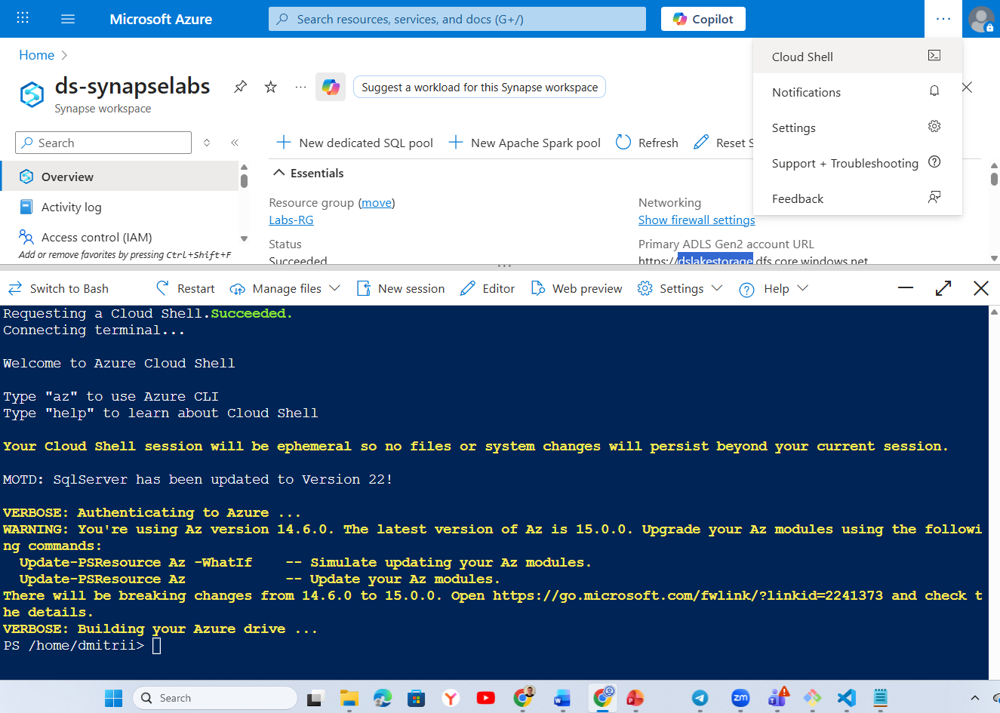

    > **Note**: If you have previously created a cloud shell that uses a *Bash* environment, use the the drop-down menu at the top left of the cloud shell pane to change it to ***PowerShell***.

1. Cloud Shell can be resized by dragging the separator bar at the top of the pane, or by using the —, **&#9723;**, and **X** icons at the top right of the pane to minimize, maximize, and close the pane. For more information about using the Azure Cloud Shell, see the [Azure Cloud Shell documentation](https://docs.microsoft.com/azure/cloud-shell/overview).

1. In the PowerShell pane, enter the following commands to clone this repository:

    ```powershell
    rm -r dp-203 -f
    git clone https://github.com/dmitriysolovev/data-engineer.git dp-203
    ```

1. After the repo has been cloned, enter the following commands to change to the folder for this exercise and run the **setup.ps1** script it contains:

    ```powershell
    cd dp-203/labs/alldata/lab17
    ./setup.ps1 'uksouth'
    ```
1. If prompted, choose which subscription you want to use (this will only happen if you have access to multiple Azure subscriptions).
1. Check and remember the resource group name provisioned by the script. It looks like **dp203-xxxxx**. You'll use this resource group to provision Fabric resource.
    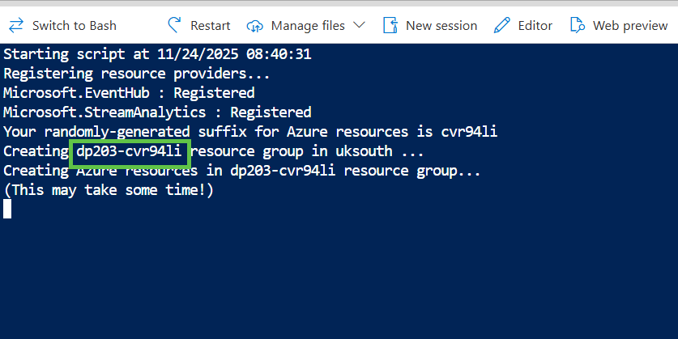
1. While you are waiting for the script to complete, continue with the next task.

## Provision a Microsoft Fabric resource
1. Open the **Azure Portal** [https://portal.azure.com](https://portal.azure.com).
1. At the top, click **Create a resource**.

1. In the search bar, type **Fabric** and press **Enter**. From the search results, select **Microsoft Fabric** anc click **Create**
    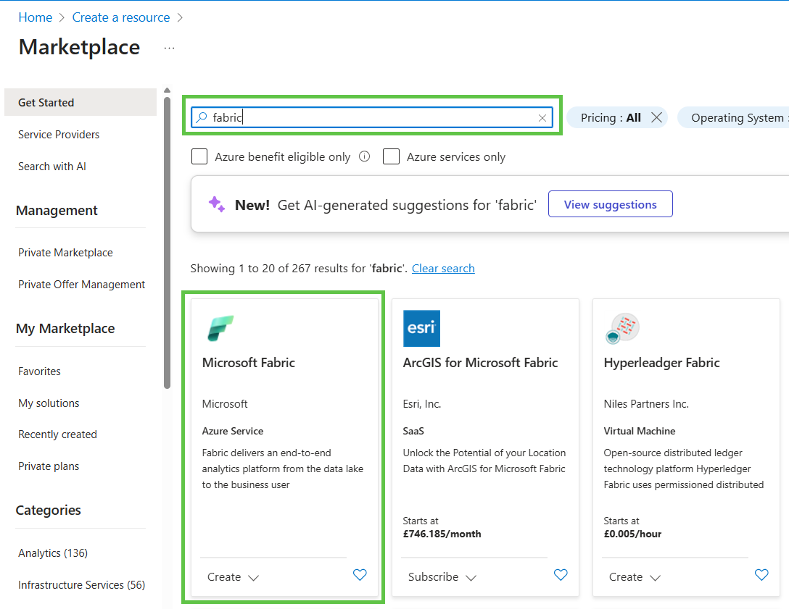
1. Click **Create**.
1. On the **Create Fabric capacity** page fill the details:
    - **Subscription**: Your subscription
    - **Resource group**: Select resource group provisioned by the script. It should have a name like **dp203-xxxxx**
    - **Capacity name**: Use unique name based on the suffix generated by the script. Like **dp203xxxxxfabric**. Capacity name must contain only lowercase letters or numbers.
    - **Region name**: Uk South
    - **Size**: F2
    - **Fabric capacity administrator**: Keep your user account
    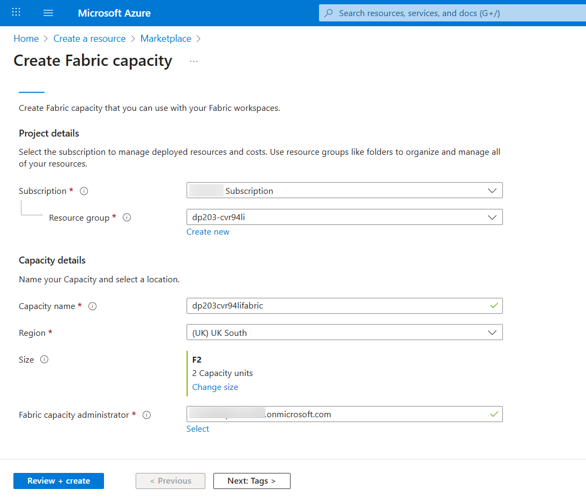
1. Press **Review and create** button. Once validated - press **Create** button to start deployment
1. Wait until the deployment finished


## Create a Power BI (Fabric) workspace

In the Power BI/Fabric service, you organize datasets, reports, and other resources in *workspaces*. Every Power BI/Fabric user has a default workspace named **My Workspace**, which you can use in this exercise; but it's generally good practice to create a workspace for each discrete reporting solution you want to manage.

1. Sign into the Power BI service at [https://app.powerbi.com/](https://app.powerbi.com/) using your Power BI service credentials (Use the same login and password as you use for other excercises).
1. If you have no Power BI/Fabric licenses assigned - sign up and follow the sign up steps to get a free trial license.
1. In the menu bar on the left, select **Workspaces** (the icon looks similar to &#128455;).
1. Create a new workspace with a meaningful name (for example, *dp203-RTI*), selecting the **Fabric** licensing mode (In the **Advanced** section) and **dp203xxxxxfabric** capacity or **Trial** if available.

    > **Note**: If you are using a trial account, you may need to enable additional trial features.
    > **Advice**: If you selected Trial mode, you should pause or delete Fabric resource provisioned earlier.

1. You successfully provisioned Fabric workspace. When viewing your workspace, note its globally unique identifier (GUID) in the page URL (which should be similar to `https://app.powerbi.com/groups/<GUID>/list`). You will need this GUID later.

## Use Azure Stream Analytics to process streaming data

An Azure Stream Analytics job defines a perpetual query that operates on streaming data from one or more inputs and sends the results to one or more outputs.

### Create a Stream Analytics job

1. Switch back to the browser tab containing the Azure portal, and when the script has finished, note the region where your **dp203-*xxxxxxx*** resource group was provisioned.
1. On the **Home** page of the Azure portal, select **+ Create a resource** and search for `Stream Analytics job`. Then create a **Stream Analytics job** with the following properties:
    - **Subscription**: Your Azure subscription
    - **Resource group**: Select the existing **dp203-*xxxxxxx*** resource group.
    - **Name**: `stream-orders`
    - **Region**: UK South or another where other resources were deployed to.
    - **Hosting environment**: Cloud
    - **Streaming units**: 1
1. Wait for deployment to complete and then go to the deployed Stream Analytics job resource.

### Create an input for the event data stream

1. On the **stream-orders** overview page, select the **Inputs** page, and use the **Add input** menu to add an **Event Hub** input with the following properties:
    - **Input alias**: `orders`
    - **Select Event Hub from your subscriptions**: Selected
    - **Subscription**: Your Azure subscription
    - **Event Hub namespace**: Select the **events*xxxxxxx*** Event Hubs namespace
    - **Event Hub name**: Select the existing **eventhub*xxxxxxx*** event hub.
    - **Event Hub consumer group**: Select the existing **$Default** consumer group
    - **Authentication mode**: Managed Identity: System Assigned
    - **Partition key**: *Leave blank*
    - **Event serialization format**: JSON
    - **Encoding**: UTF-8
    - **Event compression type**: None
    - **Schema registry**: None

1. Save the input and wait while it is created. You will see several notifications. Wait for a **Successful connection test** notification.

### Create an output for the Power BI workspace

 > **Note**: Microsoft are going to deprecate this functionality by 31st of October 2027. Alternate way - use Faric Real Time Capabilities. We'll review them in a separate excercise.

1. View the **Outputs** page for the **stream-orders** Stream Analytics job. Then use the **Add output** menu to add an **Power BI** output with the following properties:
    - **Output alias**: `powerbi-dataset`
    - **Select Power BI from your subscriptions**: Selected
    - **Group workspace**: dp203-RTI
    - **Authentication mode**: *Select* **Managed Indentity: System Assigned**
    - **Dataset name**: `realtime-data`
    - **Table name**: `orders`

    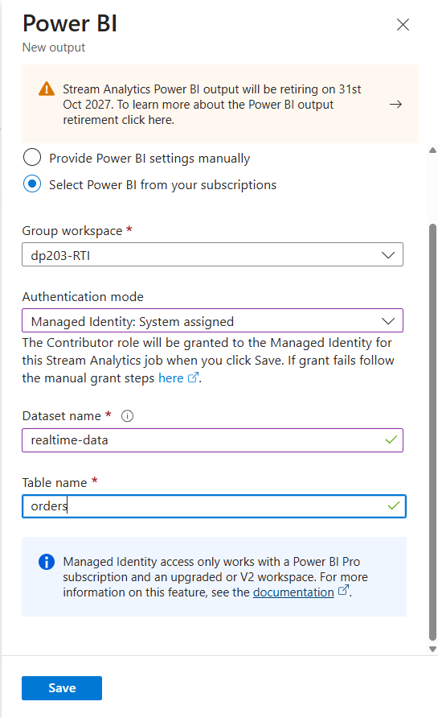

1. Save the output and wait while it is created. You will see several notifications. Wait for a **Successful connection test** notification.

### Create a query to summarize the event stream

1. View the **Query** page for the **stream-orders** Stream Analytics job.
1. Modify the default query as follows:

    ```
    SELECT
        DateAdd(second,-5,System.TimeStamp) AS StartTime,
        System.TimeStamp AS EndTime,
        ProductID,
        SUM(Quantity) AS Orders
    INTO
        [powerbi-dataset]
    FROM
        [orders] TIMESTAMP BY EventEnqueuedUtcTime
    GROUP BY ProductID, TumblingWindow(second, 5)
    HAVING COUNT(*) > 1
    ```

    Observe that this query uses the **System.Timestamp** (based on the **EventEnqueuedUtcTime** field) to define the start and end of each 5 second *tumbling* (non-overlapping sequential) window in which the total quantity for each product ID is calculated.

3. Save the query.

### Run the streaming job to process order data

1. View the **Overview** page for the **stream-orders** Stream Analytics job, and on the **Properties** tab review the **Inputs**, **Query**, **Outputs**, and **Functions** for the job. If the number of **Inputs** and **Outputs** is 0, use the **&#8635; Refresh** button on the **Overview** page to display the **orders** input and **powerbi-dataset** output.
2. Select the **&#9655; Start** button, and start the streaming job now. Wait until you are notified that the streaming job started successfully.
3. Re-open the cloud shell pane and run the following command to submit 100 orders.

    ```
    node ~/dp-203/labs/alldata/lab17/orderclient
    ```

4. While the order client app is running, switch to the Power BI app browser tab and view your workspace.
5. Refresh the Power BI app page until you see the **realtime-data** dataset in your workspace. This dataset is generated by the Azure Stream Analytics job.

## Visualize the streaming data in Power BI

Now that you have a dataset for the streaming order data, you can create a Power BI dashboard that represents it visually.

1. Return to your PowerBI browser tab.

1. Press **New Item** button and select **Dashboard**. Create a new dashboard named **Order Tracking**

1. On the **Order Tracking** dashboard, select the **&#9999;&#65039; Edit** menu, then select **+ Add a tile**. Then in the **Add a tile** pane, select **Custom Streaming Data** and select **Next**:

1. In the **Add a custom streaming data tile** pane, under **Your datasets**, select the **realtime-data** dataset, and select **Next**.

1. Change the default visualization type to **Line chart**. Then set the following properties and select **Next**:
    - **Axis**: EndTime
    - **Value**: Orders
    - **Time window to display**: 1 Minute

1. On the **Tile details** pane, set the **Title** to **Real-time Order Count** and select **Apply**.

1. Switch back to the browser tab containing the Azure portal, and if necessary, re-open the cloud shell pane. Then re-run the following command to submit another 100 orders.

    ```
    node ~/dp-203/labs/alldata/lab17/orderclient
    ```

1. While the order submission script is running, switch back to the browser tab containing the **Order Tracking** Power BI dashboard and observe that the visualization updates to reflect the new order data as it is processed by the Stream Analytics job (which should still be running).

    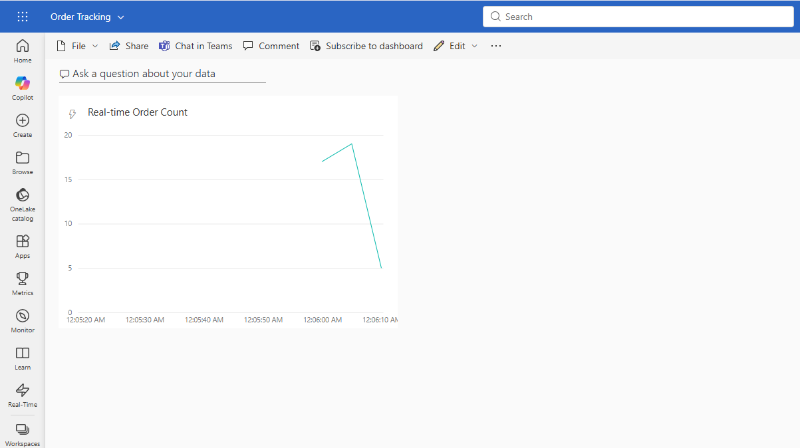

    You can re-run the **orderclient** script and observe the data being captured in the real-time dashboard.

# Get started with Real-Time Dashboards in Microsoft Fabric

Real-time dashboards in Microsoft Fabric enable you to visualize and explore streaming data using the Kusto Query Language (KQL).  In this exercise, you'll explore how to create and use a real-time dashboard based on a real-time data source.

## Create an eventhouse

Not it's time to start creating the Fabric items you'll need for the real-time intelligence solution. we'll start by creating an eventhouse.

1. Ensure you're on **PowerBI** or **Fabric** browser tab.
1. In the **dp203-RTI** workspace click the **New Item** button. In the *New item* panel, under the *Store data* section, select **Eventhouse**. Give it a unique name of your choice, for example **dp203-orders-eh**
1. Close any tips or prompts that are displayed until you see your new empty eventhouse.

    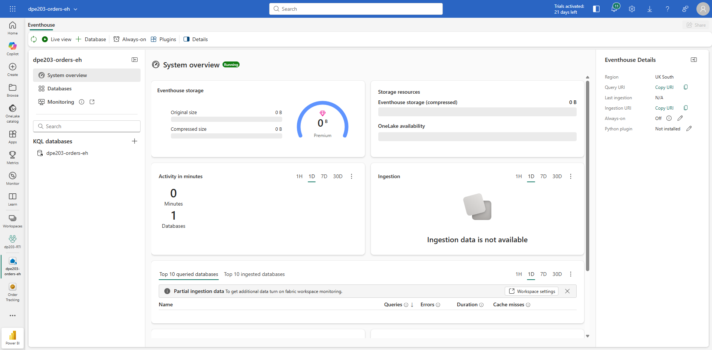

1. In the pane on the left, note that your eventhouse contains a KQL database with the same name as the eventhouse.
1. Select the KQL database to view it.


## Get data from Event Hubs

1. Open the KQL database menu, select **Get data** -> **Event Hubs**
    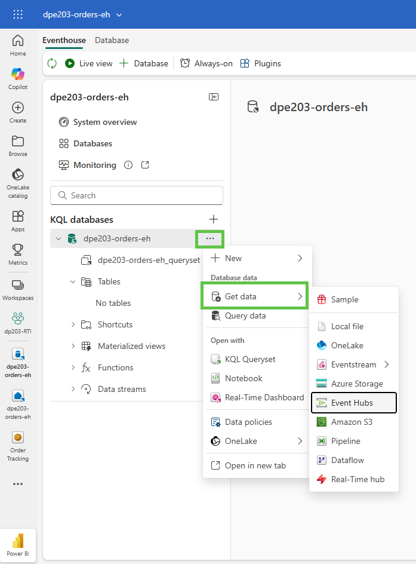
1. In the wizard window create a new table and name it **orders**. **Configure the data source** section appears
1. Open new browser tab, open [https://portal.azure.com](https://portal.azure.com) and navigate to event hub in the **dp203-xxxxx** resource group.
1. On the **Event Hub** (Name like: **eventhub*xxxxxx*** ) on the left panel in the **Settings** section select **Shared Access Policies** and press **Add** and create policy with the following parameters:
    - **Policy name**: fabricpolicy
    - **Send**: Checked
    - **Listen**: Checked
    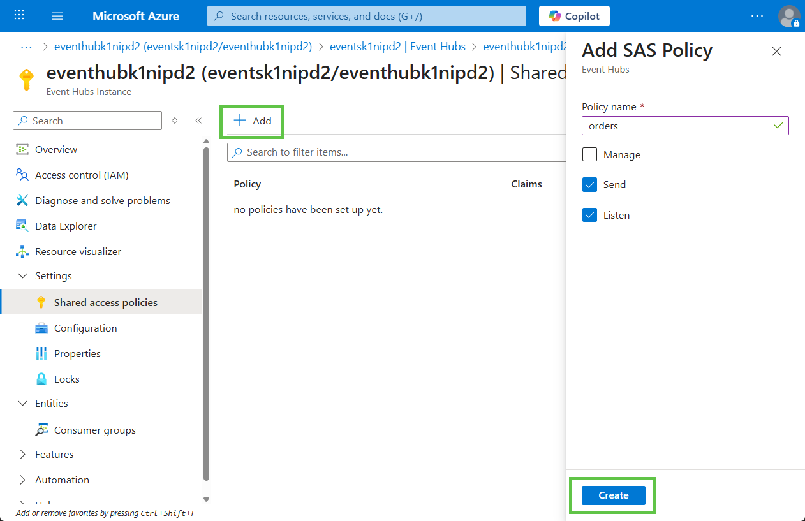
1. Once **fabricpolicy** created, click on it and copy Primary key
    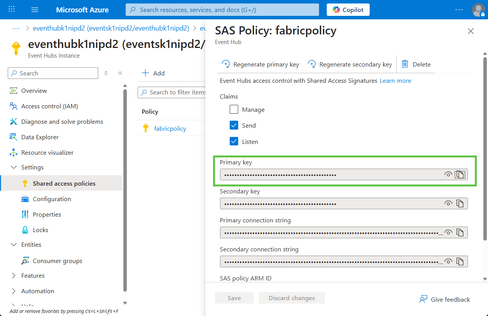

1. Navigate to the **PowerBI** or **Fabric** browser tab.
1. In the **Configure the data source** section in the **Event hub** line select **Create new connection**
1. Pop-up window **New connection** appears. Create new connection using the following parameters (replacing *xxxxx* with the actual suffix):
    - **Event Hub namespace**: events*xxxxx*
    - **Event Hub**: eventhub*xxxxx*
    - **Connection**: Create new connection
    - **Connection name**: orders-eventhub
    - **Data gateway**: None
    - **Authentication kind**: Shared Access Key
    - **Shared Access Key Name**: fabricpolicy
    - **Shared Access Key**: *insert Primary key copied*
    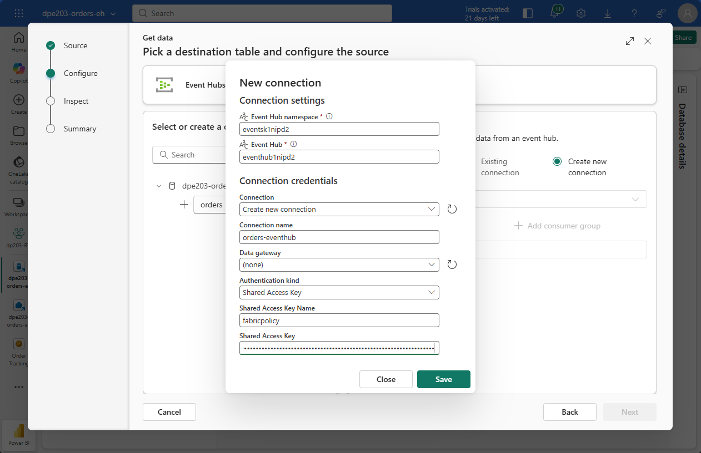
1. Press **Save** button.
    > **Note**: In case of any errors create new browser tab, navigate to [https://app.powerbi.com/groups/me/gateways?experience=power-bi](https://app.powerbi.com/groups/me/gateways?experience=power-bi), find your connection and delete it. Once done - try to create a new connection again. Most likely there were typos.
1. Review pop-up window (if any) and press **Close** button.
1. In the **Consumer group** dropdown select **$Default**. Press **Next** button
1. Wait a bit. System will show a data preview. Press **Finish** button
    
1. On the next screen wait while all steps in the **Data Preparation** section become green. Press **Finish** button.
    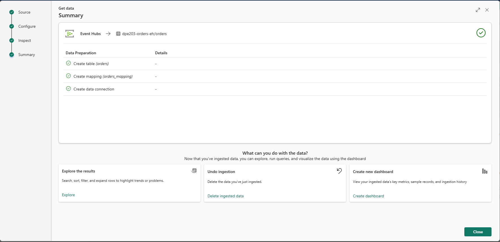
1. **orders** table appears in the KQL database
    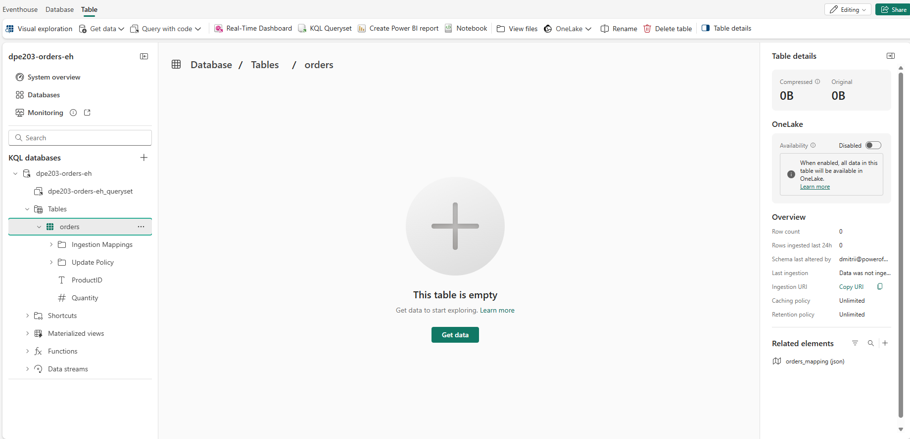
1. Switch back to the browser tab containing the Azure portal, and if necessary, re-open the cloud shell pane. Then re-run the following command to submit another 100 orders.

    ```
    node ~/dp-203/labs/alldata/lab17/orderclient
    ```  
1. Switch back to the browser tab with the eventhouse and press **Refresh** button in top lef corner. Ingested data shoud appear in the Eventhouse.

    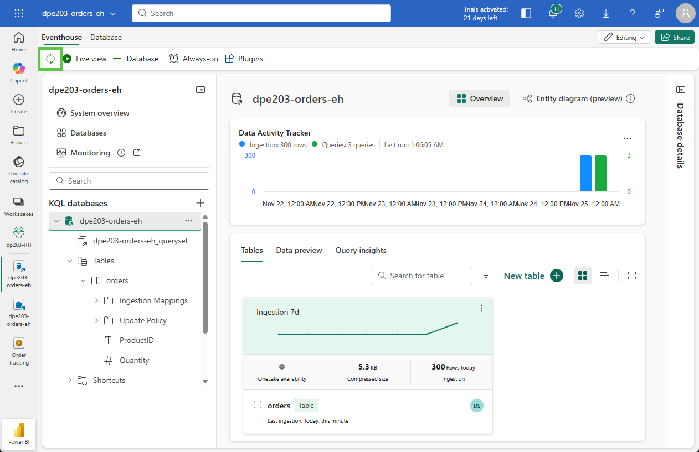
   
## Create a real-time dashboard

Now that you have a stream of real-time data being loaded into a table in the eventhouse, you can visualize it with a real-time dashboard.

1. Select **orders** table and on the *Table* tab of the ribbon select **Real-Time Dashboard** and name it `orders-dashboard`.
    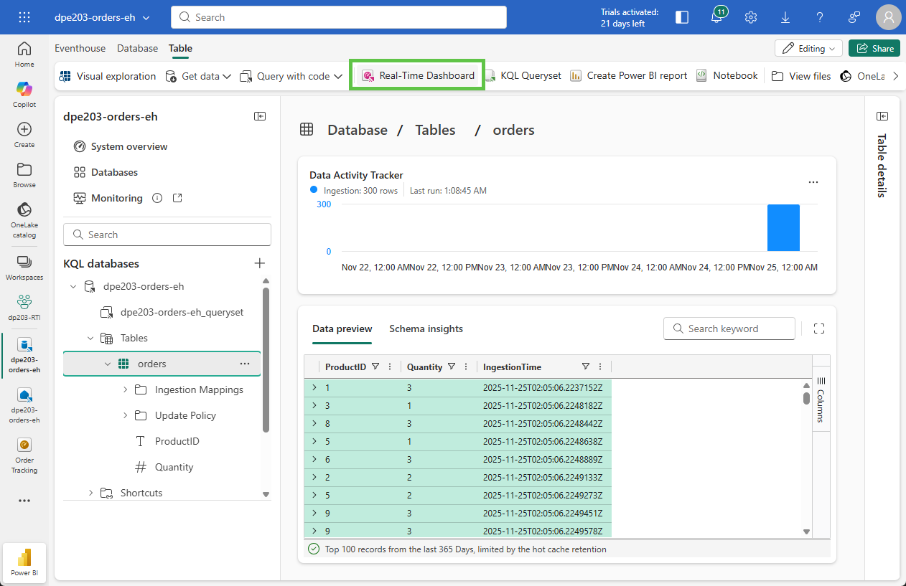

1. A new empty dashboard is created.

    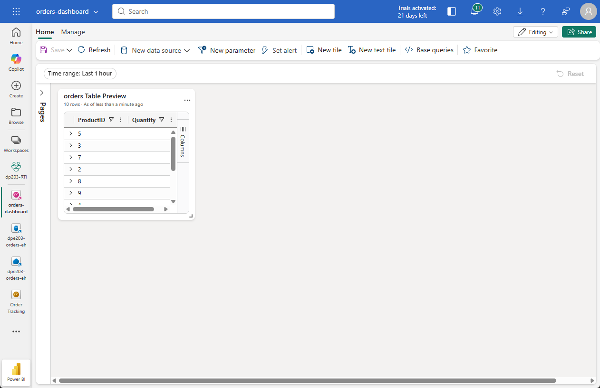

1. In the ribbon, select **New tile**. Query editor appears.
1. In the query editor, ensure that the **Bike Rental Data** source is selected and enter the following KQL code:

    ```kql
    orders
| summarize totalQuantity=sum(Quantity) by ProductID
| project ProductID, totalQuantity
| render barchart
    with (
    title="Total Quantity by Product ID",
    ytitle="Total Quantity",
    xtitle="Product ID",
    legend=hidden
    )
    ```
    Your query editor should look like on the screenshot
    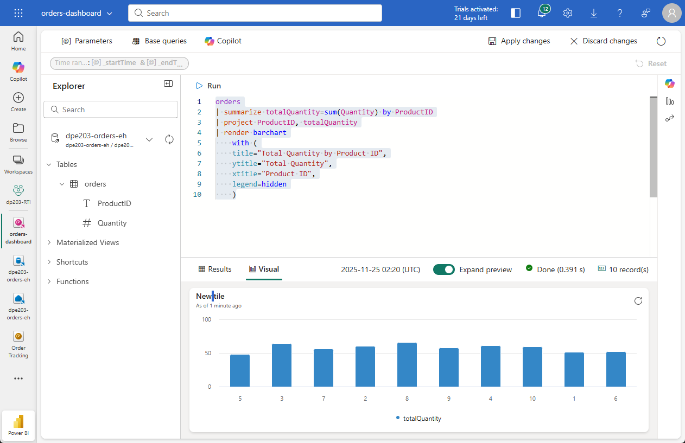
1. Press **Apply changes** and explore your Real Time Dashboard. Hower on the **New tile**, press **Edit** and in the **Tile name** textbox type **Orders**. Apply changes.
1. Now your dashboard should look like on the screenshot.
    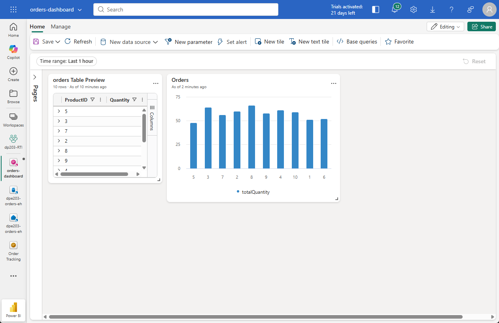
1. Press **Save** button on the ribbon. Once changes saved, in the top right corner switch to the **Viewing** mode.
    
1. Run orders generation script and refresh tile to see changes.

You successfully connected Fabric Eventhouse to Event Hub and built realtime dashboard. Now you can explore all the resources created in **Power BI** workspace before deletion.


## Delete resources

If you've finished exploring Azure Stream Analytics and Power BI, you should delete the resources you've created to avoid unnecessary Azure costs.

1. Close the browser tab containing the Power BI report. Then in the **Workspaces** pane, in the **&#8942;** menu for your workspace select **Workspace settings** and delete the workspace.
2. Return to the browser tab containing the Azure Portal, close the cloud shell pane, and use the **&#128454; Stop** button to stop the Stream Analytics job. Wait for the notification that the Stream Analytics job has stopped successfully.
3. On the Azure portal, on the **Home** page, select **Resource groups**.
4. Select the **dp203-*xxxxxxx*** resource group containing your Azure Event Hub and Stream Analytics resources.
5. At the top of the **Overview** page for your resource group, select **Delete resource group**.
6. Enter the **dp203-*xxxxxxx*** resource group name to confirm you want to delete it, and select **Delete**.

    After a few minutes, the resources created in this exercise will be deleted.
